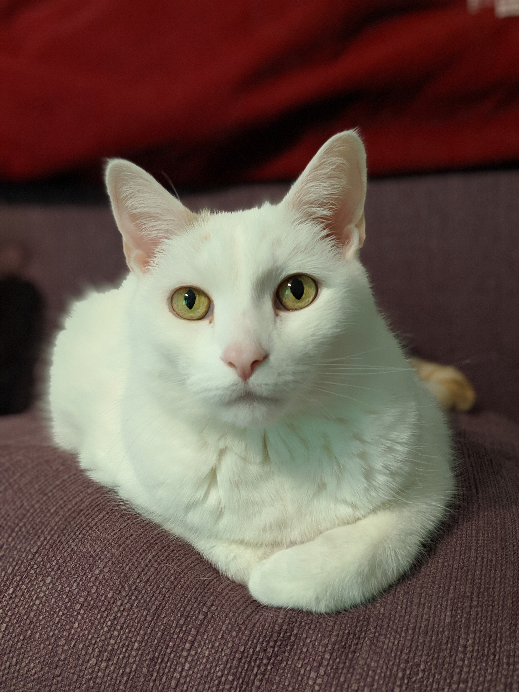
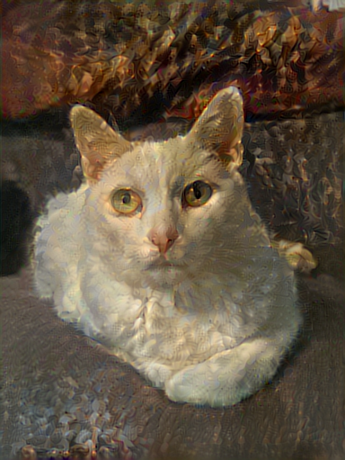

# generative-style-transfer
Generative-style-transfer with tensorflow 2

A simple implementation of neural style transfer in python using Tensorflow 2.0.

Base Image                 | Style Image               | Final Image
:-------------------------:|:-------------------------:|:-------------------------:
 |  |  

## Build docker Image

```bash
docker-compose up
```

## Build docker Container
*with Jupyter Notebook on port http://localhost:8888*

```bash
nvidia-docker run -it -d \
  -p 8888:8888 \
  -u $(id -u):$(id -g) \
  -e HOME=/home/$USER \
  -v /home/$USER:/home/$USER \
  generative_image  \
  --notebook-dir=$PWD
```

## Run an example within container
```bash
python3 StyleTransfer.py \
  -c cat_content.jpg \
  -s the_fall_of_phaeton.jpg \
  --epoch 3
```
