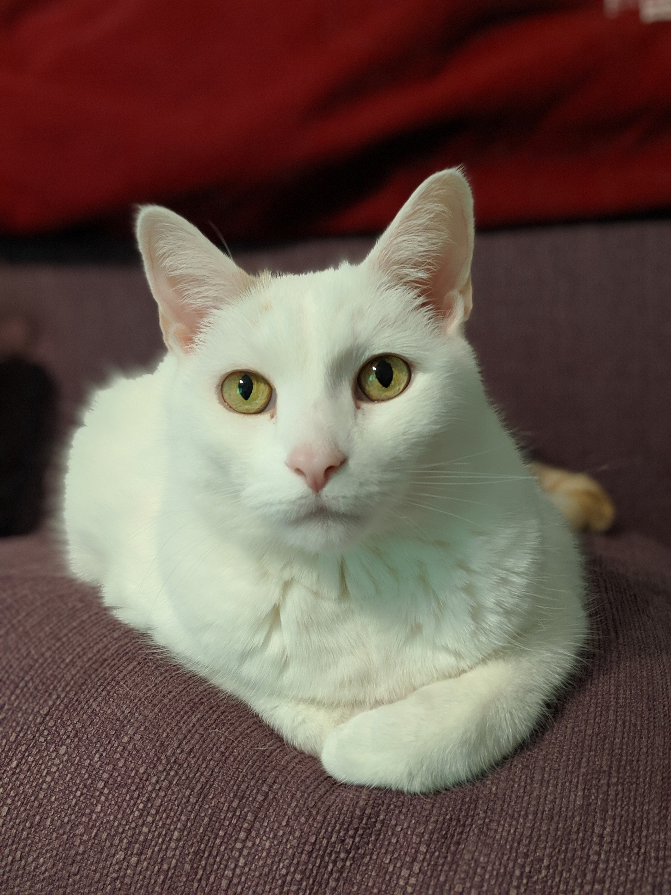

# generative-style-transfer
Generative-style-transfer with tensorflow 2

A simple implementation of neural style transfer in python using Tensorflow 2.0.

Base Image | Style Image | Final Image
:-------------------------:|:-------------------------:|:-------------------------:
 |  |  

## Build docker Image

```bash
./run.sh
```

## Customize
Modifications may be made to the style and content images, as well as hyperparameters, from the .env file. 

```bash
CONTENT_PATH=sample_images/daphnee_cat.jpg
STYLE_PATH=sample_images/the_fall_of_phaeton.jpg
EPOCHS=3
STEPS_PER_EPOCH=200
STYLE_WEIGHT=.002
CONTENT_WEIGHT=10000
TOTAL_VARIATION_WEIGHT=100000000
MAX_DIM=512
USER=brandon
```