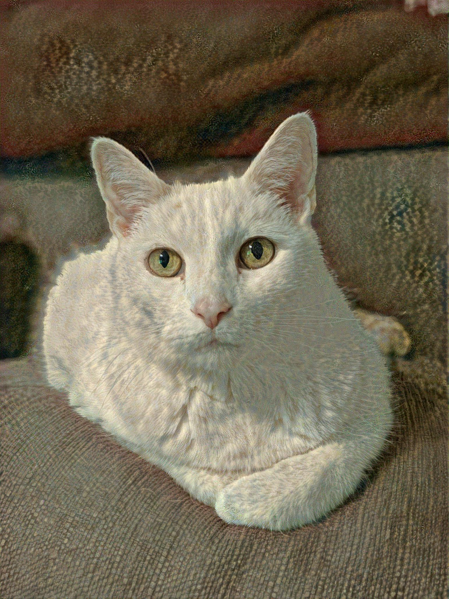

# generative-style-transfer
Generative-style-transfer with tensorflow 2

A simple implementation of neural style transfer in python using Tensorflow 2.x. Requires git clone with lfs support.

Content Image | Style Image | Final Image
:-------------------------:|:-------------------------:|:-------------------------:
 |  |  

## Customize Style Transfer
Modifications may be made to the style and content images, as well as hyperparameters, from the .env file.

```text
CONTENT_PATH=~/generative-style-transfer/app/sample_images/daphnee_cat.jpg
STYLE_PATH=~/generative-style-transfer/app/sample_images/the_fall_of_phaeton.jpg
EPOCHS=10
STEPS_PER_EPOCH=100
STYLE_WEIGHT=1e-3
CONTENT_WEIGHT=1e4
TOTAL_VARIATION_WEIGHT=1e4
MAX_DIM=3000
```


## Run Style Transfer!

```bash
docker compose up --build
```